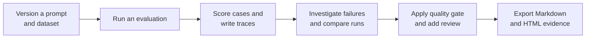
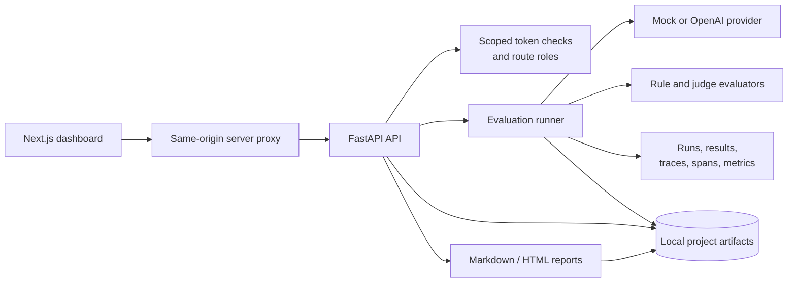

# AgentOps Evaluation & Observability Studio

[](https://github.com/KarthikRamesh9149/AgentOps-Evaluation-Observability-Studio/actions/workflows/ci.yml)

**A local quality-control loop for AI systems.** Turn a versioned prompt and dataset into a reproducible evaluation run, inspect the traces behind failures, make a release decision with a quality gate, and retain a reviewable report—all without making a hosted observability platform a prerequisite.


> Built for evaluating prompts, RAG flows, and tool-using agents locally. It is not a hosted multi-tenant observability service or a production deployment blueprint.

## Why this product exists

Model changes are easy to ship and hard to explain. A pass rate without the input, trace, prompt version, and reviewer decision behind it is not a useful engineering artifact. AgentOps makes that evidence loop concrete:



### Who it is for

| Persona | Job to be done | What the workbench provides |
| --- | --- | --- |
| AI platform engineer | Standardize how teams evaluate an AI change before integration. | Versioned prompt/dataset artifacts, deterministic runs, configurable gates, and portable reports. |
| Forward-deployed engineer | Diagnose a customer-specific RAG or agent regression with an auditable local workflow. | Case-level results, trace waterfalls, failure views, review annotations, and local-file portability. |
| AI product / quality lead | Decide whether a change is acceptable—and explain why. | Aggregate metrics, failed-case drill-down, run comparisons, gate decisions, and human review records. |

## The product loop

1. **Define the contract.** Create or import a project’s YAML prompt versions and JSONL evaluation cases.
2. **Run with a known provider.** Use the deterministic mock provider for offline development and CI, or explicitly select OpenAI for an experiment.
3. **Inspect what happened.** Open run details for score, latency, estimated cost, and failed cases; follow each case into its trace and spans.
4. **Find the regression.** Compare runs, prompt versions, or models; inspect failure categories such as citation, tool-call, and JSON-output issues.
5. **Decide and preserve evidence.** Apply the project quality gate, record a reviewer annotation, and export Markdown or HTML reporting artifacts.

<p align="center">
  
  
</p>

## Differentiated capabilities

- **Evaluation evidence, not a single dashboard number.** The runner links prompt version, dataset, per-case result, evaluator score, trace/span data, gate decision, and report artifact.
- **AI-native coverage.** Built-in flows cover RAG citation and faithfulness, tool calls, regression comparisons, JSON-output validity, latency, estimated cost, and failure analysis.
- **Inspectability by design.** Projects and generated artifacts are readable local YAML, JSONL, JSON, Markdown, and HTML beneath `data/projects/{project_id}/`.
- **A pragmatic provider seam.** Mock inference is deterministic and network-free; OpenAI is opt-in, with explicit output limits and optional judge evaluation.
- **Human judgment remains first-class.** Reviewers can annotate evidence and quality gates express policy; evaluator scores alone do not automatically promote a change.

## Architecture



The browser calls `/api/backend/*` on the Next.js app. That server-side route adds the scoped backend token from `AGENTOPS_API_TOKEN`; it is not exposed as a `NEXT_PUBLIC_*` browser variable. The FastAPI backend owns artifact reads and writes.

## Tech stack

| Layer | Implementation |
| --- | --- |
| Operator experience | Next.js App Router, TypeScript, Tailwind CSS, Recharts |
| Control plane | FastAPI and Python |
| Evaluation runtime | Provider abstraction, rule evaluators, optional OpenAI judge evaluator |
| Evidence store | Local YAML, JSONL, JSON, Markdown, and HTML artifacts |
| Verification | Pytest, Ruff, mypy, TypeScript, Playwright, mock-only CI |

## Quick start: run the offline demo

**Prerequisites:** Python 3.11+, Node.js 22+, and Chromium if you will run browser tests.

```bash
cp .env.example .env
make backend-install
make frontend-install
make seed-demo
```

For the safest local setup, create a scoped token record and use the secret only in the frontend server environment:

```bash
python3 -c 'import hashlib,secrets; s=secrets.token_urlsafe(32); print("secret:",s); print("record: local-operator:operator:"+hashlib.sha256(s.encode()).hexdigest())'
```

In the root `.env`, keep `LLM_PROVIDER=mock` and set `API_TOKENS` to the printed record. Before starting the frontend, export its server-only settings in that terminal:

```bash
export AGENTOPS_API_BASE_INTERNAL=http://127.0.0.1:8000
export AGENTOPS_API_TOKEN=local-operator.<secret>
```

Start the services in separate terminals, then open <http://127.0.0.1:3000>:

```bash
make backend-dev
```

```bash
make frontend-dev
```

For a short-lived, loopback-only visual demo, `ALLOW_INSECURE_LOCAL_DEMO=true` is available only when `APP_ENV=local`. It is not suitable for shared machines or network binding.

## Operator walkthrough

Use the seeded **Demo AgentOps Quality Studio** to follow the loop:

1. Open the project and inspect its prompt versions and datasets.
2. Start a mock evaluation; mock mode is deterministic and has no network or API cost.
3. Open the latest run to review case outcomes, aggregate metrics, and trace links.
4. Use **Compare**, **Observability**, and **Failures** to identify the meaningful change rather than relying only on an aggregate score.
5. Apply the quality gate, leave a review annotation, then open **Reports** for the generated Markdown/HTML evidence.


## Product decisions and trade-offs

| Decision | Benefit | Deliberate limit |
| --- | --- | --- |
| Local, inspectable artifacts instead of a managed data plane | Evidence travels with the project and is easy to inspect or diff. | No transactional concurrency or database-grade access control; use one writer process unless storage is redesigned. |
| Mock provider as the normal dev/CI path | Reproducible, offline, zero-cost verification. | It is not a proxy for live-model quality. |
| OpenAI is explicit and bounded | Enables targeted live experiments without making paid calls the default. | Token and cost values are estimates, not provider billing records. |
| Gates plus human review | Makes release policy visible and reviewable. | The system does not auto-promote high-impact AI changes. |

## Proof you can reproduce

The repository keeps the verification path executable rather than claiming a benchmark result in the README:

```bash
make backend-lint
make backend-typecheck
make backend-test
make frontend-typecheck
make frontend-build
make frontend-e2e
make evals
make quality-gate
make report
```

`make verify` runs the integrated local path, including seeding, evals, browser testing, and the quality gate. CI uses the mock provider and read-only GitHub permissions. A passing suite validates the behavior under test; it does not certify an internet-facing production deployment.

## Trust features and operating boundaries

The workbench uses rotation-ready scoped service tokens (`viewer`, `reviewer`, `operator`, and `admin`), SHA-256 digest storage, constant-time verification, bounded request bodies, per-token rate limits, and role-limited destructive operations. The server-side proxy prevents the backend credential being compiled into browser code.

For any shared deployment, put TLS and a real secret manager in front of it, use an external IdP or trusted identity-aware proxy, back up `data/`, and set outer reverse-proxy limits below the application’s request and rate limits. Do not place sensitive production prompts or datasets in this local demo without an appropriate retention and access policy.

See the full [security threat model](docs/security-threat-model.md) and [API/authentication reference](docs/api.md).

## Documentation

- [Architecture](docs/architecture.md)
- [Evaluation design](docs/evaluation-design.md)
- [Tracing design](docs/tracing-design.md)
- [Metrics](docs/metrics.md)
- [Quality gates](docs/quality-gates.md)
- [Local development](docs/local-development.md)
- [Demo script](docs/demo-script.md)

## Non-goals

- Hosted multi-tenant operation, per-user SSO, or distributed tracing.
- Authoritative billing or compliance certification.
- Automatic production promotion based only on evaluator scores.
- Replacing human review for high-impact agent changes.
