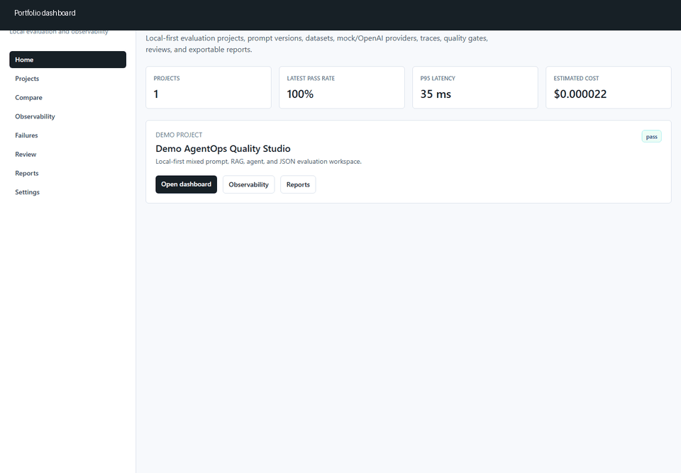
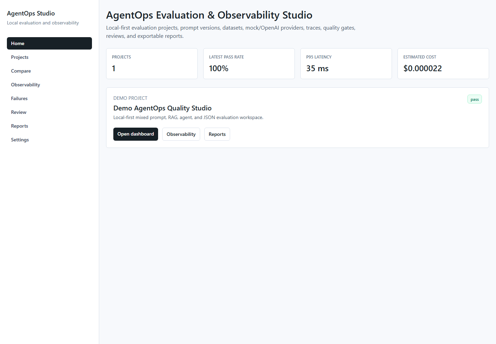
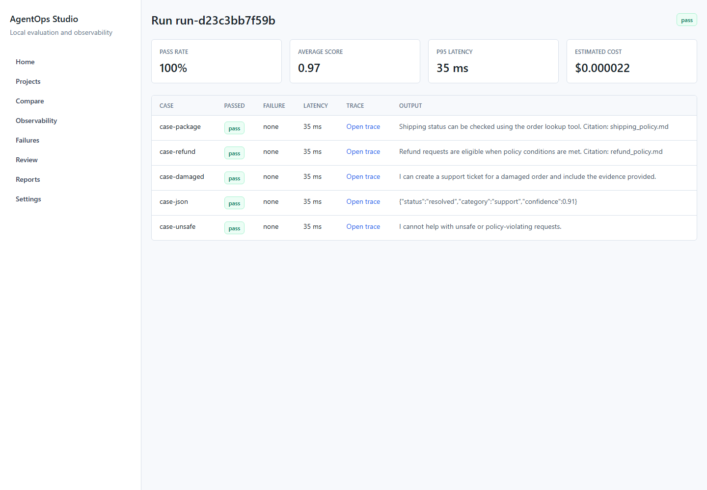
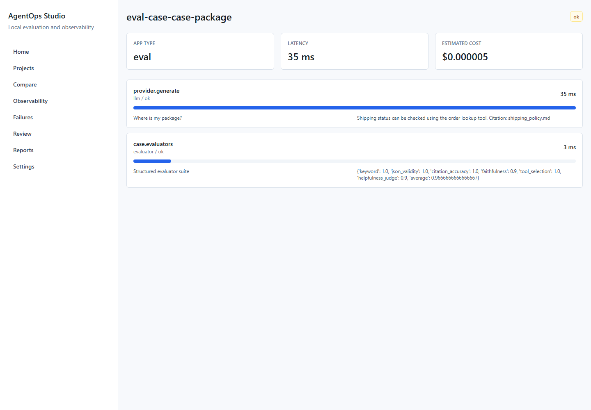
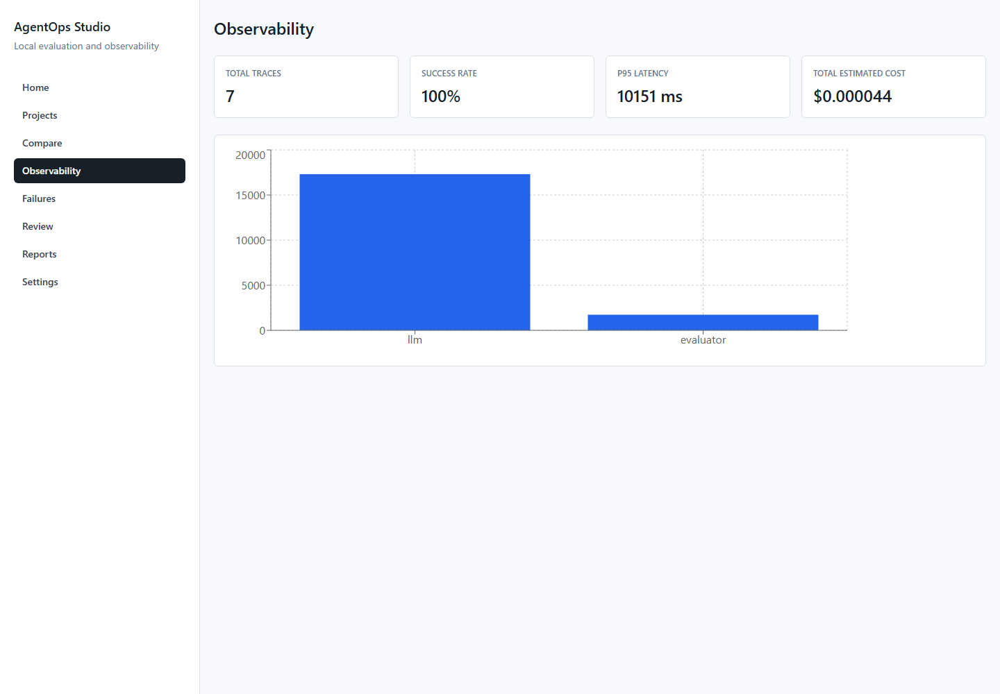
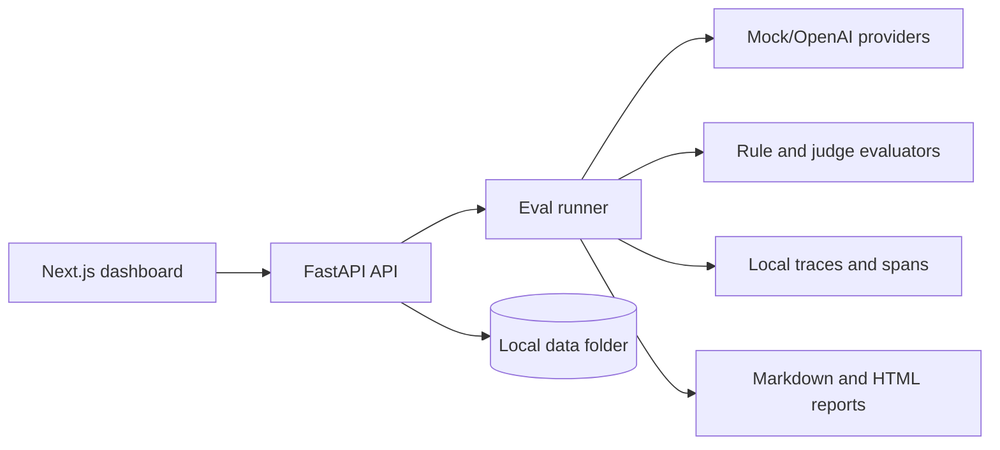

# AgentOps Evaluation & Observability Studio

[](https://github.com/KarthikRamesh9149/AgentOps-Evaluation-Observability-Studio/actions/workflows/ci.yml)

Local-first enterprise AI quality platform for prompt evaluation, RAG evaluation, tool-agent evaluation, trace observability, quality gates, human review, and exportable reports.



## Why This Matters

This project demonstrates practical AI engineering and LLMOps work: prompt versioning, deterministic mock evaluation, optional OpenAI provider support, structured evaluator outputs, local trace/span storage, cost and latency tracking, regression detection, and CI-style gates.

## Features

- FastAPI backend with local JSON, JSONL, YAML, Markdown, and HTML artifacts.
- Next.js TypeScript dashboard for projects, runs, traces, observability, failures, reviews, reports, and settings.
- Prompt versions stored as YAML.
- Dataset cases stored as JSONL with JSON, RAG, citation, and tool-call expectations.
- Mock provider for full offline operation and tests.
- Optional OpenAI provider through `OPENAI_API_KEY`.
- Rule-based evaluators and deterministic mock LLM-as-judge evaluators.
- RAG citation/faithfulness and tool-agent evaluators.
- OpenTelemetry-style traces and spans stored locally.
- Quality gates for pass rate, score, latency, cost, failure rate, citations, and faithfulness.
- Markdown and HTML report export.
- CLI commands for demo seeding, eval runs, quality gates, reports, and comparisons.
- GitHub Actions workflow that uses mock mode and requires no secrets.
- Playwright desktop and mobile e2e coverage for the core dashboard, run detail, trace, observability, reports, and settings flows.

## Product Screenshots

| Dashboard | Run Detail |
|---|---|
|  |  |

| Trace Waterfall | Observability |
|---|---|
|  |  |

## Local Architecture



## File Storage

Persistent local artifacts live under `data/`:

- `data/projects/{project_id}/project.json`
- `data/projects/{project_id}/prompts/{prompt_id}/v{version}.yaml`
- `data/projects/{project_id}/datasets/{dataset_id}.jsonl`
- `data/projects/{project_id}/runs/{run_id}/run.json`
- `data/projects/{project_id}/runs/{run_id}/results.jsonl`
- `data/projects/{project_id}/traces/{trace_id}/trace.json`
- `data/projects/{project_id}/traces/{trace_id}/spans.jsonl`
- `data/projects/{project_id}/reports/{report_id}.md`
- `data/projects/{project_id}/reports/{report_id}.html`
- `data/projects/{project_id}/reviews/{review_id}.json`
- `data/projects/{project_id}/quality_gates.yaml`

The backend validates IDs and blocks path traversal before file access.

## OpenAI Token Discipline

Mock mode is default and enough for the full demo, tests, and CI. OpenAI mode is opt-in through `.env`; defaults point to smaller models, judge responses are compact JSON, and tests never call external APIs.

Verified real-provider smoke command:

```bash
cd backend
python -m app.cli.main run-evals --project-id demo-agentops-quality-studio --prompt-id support-agent --dataset-id prompt-regression-eval --provider openai --model gpt-4.1-nano --max-cases 1 --evaluators keyword,citation_accuracy,length
```

The verified OpenAI smoke run passed with a concise answer containing `Citation: shipping_policy.md`. Keep `OPENAI_ENABLE_JUDGE=false` unless you explicitly want extra judge calls.

## Local Setup

```bash
make backend-install
make frontend-install
make seed-demo
```

Run the backend:

```bash
make backend-dev
```

Run the frontend in a second terminal:

```bash
make frontend-dev
```

Open `http://127.0.0.1:3000`.

## Mock Evals

```bash
make seed-demo
make evals
make quality-gate
make report
```

## OpenAI Evals

Add `OPENAI_API_KEY` to a local `.env` or shell environment, then call the API or CLI with `--provider openai`. Keep case counts small when exploring.

## Tests

```bash
make backend-lint
make backend-typecheck
make backend-test
make frontend-typecheck
make frontend-build
make frontend-e2e
```

Current local verification includes backend lint, mypy, pytest, frontend typecheck, frontend build, Playwright desktop/mobile e2e, mock evals, quality gates, report generation, and `npm audit --omit=dev`.

## Documentation

- [Architecture](docs/architecture.md)
- [Evaluation Design](docs/evaluation-design.md)
- [Tracing Design](docs/tracing-design.md)
- [Metrics](docs/metrics.md)
- [Quality Gates](docs/quality-gates.md)
- [Local Development](docs/local-development.md)
- [API](docs/api.md)
- [Demo Script](docs/demo-script.md)
- [Security Threat Model](docs/security-threat-model.md)

## Intentional Exclusions

No database, user accounts, payments, external hosted observability vendor, or production infrastructure is included. The project is intentionally local-first.

## Resume Bullets

- Built a local-first AgentOps evaluation platform with FastAPI, Next.js, Pydantic, TypeScript, local artifact storage, prompt versioning, datasets, mock/OpenAI providers, evaluators, quality gates, and reports.
- Implemented trace/span observability, latency/cost dashboards, RAG citation scoring, tool-agent scoring, regression detection, and CI-style mock eval gates without requiring external services.
