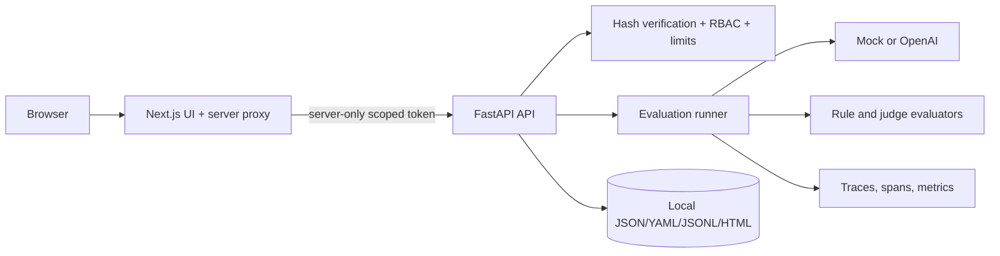

# AgentOps Evaluation & Observability Studio

[](https://github.com/KarthikRamesh9149/AgentOps-Evaluation-Observability-Studio/actions/workflows/ci.yml)

A local-first quality workbench for prompts, RAG systems, and tool-using agents. It turns datasets into reproducible runs, evaluator scores, traces, quality decisions, human reviews, and exportable reports without requiring a hosted observability vendor.


## Capabilities

- FastAPI API and a Next.js TypeScript dashboard.
- Versioned YAML prompts and JSONL datasets stored as inspectable local artifacts.
- Deterministic mock inference and evaluators for offline development and CI.
- Optional OpenAI inference with explicit provider selection and output caps.
- RAG citation/faithfulness, tool-call, regression, latency, cost, and failure metrics.
- Trace/span waterfalls, run comparison, quality gates, reviewer annotations, and Markdown/HTML reports.
- Hashed, role-scoped API tokens; no plaintext token is stored in application configuration.
- A server-side frontend proxy that keeps backend credentials out of browser JavaScript.
- Request-body ceilings, per-token rate limits, constant-time digest verification, and fail-closed production settings.

This repository is intentionally local-first. It is not a hosted, multi-tenant SaaS and does not include an external IdP, database, distributed workers, or production infrastructure.

## Architecture



The browser calls same-origin `/api/backend/*`. The Next.js route handler adds `AGENTOPS_API_TOKEN` from its server environment and forwards to the backend configured by `AGENTOPS_API_BASE_INTERNAL`. The token is never compiled into a `NEXT_PUBLIC_*` variable.

## Identity and authorization

For a local workbench, a full identity provider would add operational weight without demonstrating the core evaluation system. The implemented boundary therefore uses rotation-ready scoped service tokens:

1. Generate a high-entropy secret.
2. Store only its SHA-256 digest in `API_TOKENS` as `token_id:role:digest`.
3. Present `Authorization: Bearer token_id.secret`.
4. Rotate by adding a new record, updating clients, then removing the old record.

Roles are `viewer`, `reviewer`, `operator`, and `admin`. All roles can read; reviewer can create/update review annotations; operator can run and mutate evaluation resources; destructive deletes require admin. Authentication compares digests in constant time and returns generic 401/403 responses.

Generate a record without printing the secret into repository files:

```bash
python3 -c 'import hashlib,secrets; s=secrets.token_urlsafe(32); print("secret:",s); print("record: local-operator:operator:"+hashlib.sha256(s.encode()).hexdigest())'
```

Put the record in backend `API_TOKENS`; put `local-operator.<secret>` in the frontend server's `AGENTOPS_API_TOKEN`. Treat both environment files as secrets. Multiple comma-separated records support zero-downtime rotation.

## Threat model

| Threat | Control | Residual risk |
| --- | --- | --- |
| Token disclosure to browser code | Same-origin server proxy and server-only environment variable | A compromised Next.js server can access its token |
| Plaintext credential theft from backend config | Backend stores token IDs, roles, and SHA-256 digests only | Weak secrets remain brute-forceable; generate high entropy |
| Over-privileged automation | Route-level role policy and admin-only deletes | Tokens are service identities, not per-human attribution |
| Brute force or request floods | Constant-time verification and bounded per-token windows | In-memory limits are per process, not distributed |
| Oversized/chunked bodies | Header precheck plus measured body cap | Reverse-proxy limits should provide an outer boundary |
| Path traversal | Identifier validation and storage-root containment | Filesystem and parser edge cases remain test targets |
| Stored script injection | Report generation escapes untrusted content | Future renderers must preserve escaping |
| Surprise API spend | Mock default, explicit OpenAI mode, case/output caps | Provider estimates are not authoritative billing data |

See [docs/security-threat-model.md](docs/security-threat-model.md) for the full trust-boundary inventory.

## Quickstart: secure local mode

Prerequisites: Python 3.11+, Node.js 22+, and a Chromium installation for browser tests.

```bash
cp .env.example .env
# Generate a token secret and API_TOKENS record using the command above.
make backend-install
make frontend-install
make seed-demo
```

Backend environment:

```env
APP_ENV=local
API_TOKENS=local-operator:operator:<sha256-digest>
LLM_PROVIDER=mock
```

Frontend server environment:

```env
AGENTOPS_API_BASE_INTERNAL=http://127.0.0.1:8000
AGENTOPS_API_TOKEN=local-operator.<secret>
```

Run `make backend-dev` and `make frontend-dev` in separate terminals, then open `http://127.0.0.1:3000`.

`ALLOW_INSECURE_LOCAL_DEMO=true` is a deliberate, localhost-only convenience and is rejected outside `APP_ENV=local`. It should not be used for shared machines or network binding.

## Mock provider and cost discipline

Mock mode is deterministic, offline, and sufficient for the dashboard, tests, reports, and CI. It incurs no provider cost. OpenAI mode is opt-in through `OPENAI_API_KEY` plus an explicit run request. Keep case counts and `OPENAI_MAX_OUTPUT_TOKENS` bounded; leave judge evaluation disabled unless needed. Token and cost figures are estimates for comparison, not billing evidence.

## Testing and quality gates

```bash
make backend-lint
make backend-typecheck
make backend-test
make frontend-typecheck
make frontend-build
make frontend-e2e
make evals
make quality-gate
make report
```

Backend security tests cover fail-closed authentication, malformed registries, role restrictions, rotation-compatible multiple tokens, request ceilings, rate limits, and sanitized health output. Playwright exercises desktop and mobile UI flows through the credential-hiding proxy. CI uses only the mock provider and read-only GitHub permissions. Passing these gates validates repository behavior under test; it does not certify internet-facing production readiness.

## Operations

- Bind backend and frontend to loopback for local use. For shared deployment, terminate TLS, use a real secret manager, and add an external IdP or trusted identity-aware proxy.
- Set `MAX_REQUEST_BYTES`, `RATE_LIMIT_REQUESTS`, and `RATE_LIMIT_WINDOW_SECONDS` below outer reverse-proxy limits.
- Rotate tokens by overlap; remove the old digest after every client has moved.
- Back up `data/` if runs and review evidence matter. Writes are local-file operations, so use one writer process unless storage is redesigned.
- Monitor 401, 403, 413, and 429 responses, failed quality gates, provider errors, and unexpected cost increases.
- Do not place sensitive production prompts or datasets in this local demo without an appropriate retention and access policy.

## Storage map

Artifacts live under `data/projects/{project_id}/`: prompt YAML, dataset JSONL, run/result JSON, trace/span JSONL, reviews, reports, and `quality_gates.yaml`. This makes the system transparent and portable, but it does not provide transactional concurrency or database-grade access control.

## Documentation

- [Architecture](docs/architecture.md)
- [Evaluation design](docs/evaluation-design.md)
- [Tracing design](docs/tracing-design.md)
- [Metrics](docs/metrics.md)
- [Quality gates](docs/quality-gates.md)
- [API and authentication](docs/api.md)
- [Local development](docs/local-development.md)
- [Security threat model](docs/security-threat-model.md)

## Non-goals

- Hosted multi-tenant operation or per-user SSO.
- Authoritative billing, compliance certification, or durable distributed tracing.
- Automatic production promotion based only on evaluator scores.
- Replacing human review for high-impact agent changes.
